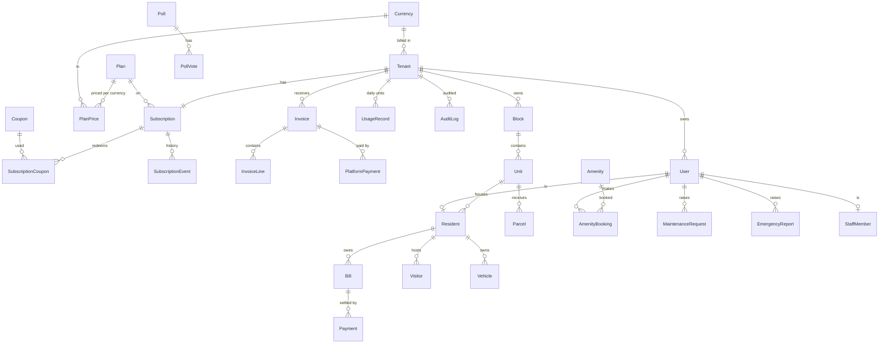

# Multi-tenant SaaS architecture

**Tenant = Estate = customer.** One PostgreSQL database, one schema, every tenant-owned row carries `tenantId`.

## Isolation — four independent walls
1. **Identity:** `tenantId` comes only from the verified JWT (`tid`). Login requires the estate code; `User` is unique on `(tenantId, email)`.
2. **Application:** a Prisma client extension (`config/prisma.js` → `config/tenantScope.js`) injects `tenantId` into every query on the 27 tenant models, overwrites any caller-supplied value, strips attempts to re-assign it, and **throws** when no tenant context exists. Route code still says `prisma.bill.findMany(...)`; inside an authenticated request that resolves to the current tenant's client (AsyncLocalStorage).
3. **Database:** PostgreSQL row-level security (`sql/002`) with `app.tenant_id`, an immutability trigger on `tenantId`, composite uniques. Run the API as the `NOBYPASSRLS` role `estatium_app` and set `ENABLE_RLS=true`.
4. **Realtime:** Socket.IO handshake verifies the JWT; rooms are `t:<tenant>:…` and joined server-side.

Platform tables (`Tenant`, `Plan`, `Subscription`, `Invoice`, …, `AuditLog`) are not tenant-scoped; they are reached only via `prisma.system` in platform code. Cross-tenant aggregates use `SECURITY DEFINER` SQL functions (`platform_tenant_stats`, `platform_billable_units`), so the Super Owner portal never reads tenant tables directly.

## ER diagram

(`PlatformUser` is separate: Super Owner staff with their own JWT.)

## Hierarchy requested
`Tenant → Properties (Block) → Units → Residents → Billing / Maintenance / Users / Reports`. "Property" maps to `Block`; add a `Property` level above `Block` later if an estate has several sites (one table, one FK).

## Tenant status ↔ behaviour
| Status | Meaning | Access |
|---|---|---|
| TRIAL | free period (`trialEndsAt`) | full; auto-converts to ACTIVE + first invoice (or EXPIRED if `autoConvert=false`) |
| ACTIVE | paying | full |
| SUSPENDED | manual, or unpaid > due date + grace | **read-only**; SOS, login, subscription page still work; auto-lifts when overdue invoices are paid |
| EXPIRED | trial over / cancelled / suspended > 30 days | login + subscription page only (HTTP 402) |
| DELETED | soft delete | HTTP 410; restorable for 30 days; then `platform_purge_tenant()` erases operational data, keeps invoices/audit/tombstone |

Only `tenants.service.setStatus()` changes status (validated state machine, mirrors Subscription, writes `SubscriptionEvent` + `AuditLog`).

## Subscription model
`monthly charge = billable units × unit price`. Billable units = units flagged `isActive` (snapshot at invoice time, or `PEAK` over the closing period). Price resolution: subscription **custom/contract price** → plan price in the tenant's currency. Also: plan minimum units, `committedUnits` + overage rate, `maxUnits` hard cap (DB trigger), coupons (percent/fixed, once/repeating/forever), credit balance, tax %, monthly/annual, trial, `paymentTermsDays`, `graceDays`. All math is integer minor units (`billing/money.js`, `billing/pricing.js`), unit-tested.

Lifecycle jobs (`jobs/scheduler.js`, hourly, advisory-locked so multiple instances are safe): snapshot usage → convert/expire trials → renew (period advanced **before** invoicing so a crash cannot double-bill) → dunning (suspend / expire) → purge deleted → mark overdue resident bills.

**Proration:** on plan/price change mid-period: credit = old period amount × remaining/total; charge = new × remaining/total; net>0 ⇒ immediate invoice, net<0 ⇒ `creditBalance` applied to the next invoice.

## Multi-currency
8 supported (USD EUR GBP AED SAR INR CAD AUD), `Currency` table drives the picker. Currency lives on `Tenant`/`Subscription`/`Invoice`/`Bill`/`Payment` (a bill keeps the currency it was issued in). `PlanPrice(plan, currency)`. Switching a tenant's currency is blocked while invoices are open and resets custom prices (no silent FX on contracts). `ExchangeRate` is used **only** for platform revenue reporting (MRR/ARR), never for billing. Formatting: `Intl.NumberFormat` (server `billing/money.format`, client `utils/money.js`). *NGN exists as an inactive currency only to migrate the legacy ₦ data.*

## API changes
| Area | Change |
|---|---|
| `POST /api/auth/login` | body now `{tenant, email, password}`; returns `{token, user, tenant, mustChangePassword}`; token claims `{sub, tid, role, tv}` |
| `/api/auth/*` | `PUT /password` returns a fresh token and revokes the rest; new `POST /logout-all` |
| `/api/public/tenants/:slug` | new, name only |
| `/api/subscription` | new, ADMIN/FINANCE: plan, units, next-invoice estimate, invoices |
| `/api/platform/*` | new Super Owner API (below) |
| `/api/billing/:id/pay` | staff only, CASH/BANK_TRANSFER; residents pay via gateway (Sprint 5) |
| `/api/billing/bulk` | idempotent; returns `{created, skippedDuplicates}` |
| `/api/maintenance/:id` | bill the resident only with `billResident:true` |
| `/api/residents` POST | role no longer accepted; returns `temporaryPassword` when none supplied |
| `POST /api/send-notification` | removed |
| Money fields | `Decimal` serialised as JSON numbers |

### Super Owner API (`/api/platform`, separate JWT, permission per route, audited)
`auth/login · auth/me · auth/password` — `tenants` list/create/get/patch · `:id/suspend|expire|activate|restore|delete|reset-admin-password` — `:id/plan|pricing|currency|coupons|cancel|uncancel|usage|estimate|invoices|events` — `invoices` list/get · `:id/payments|void` · `billing/run` — `plans` + `plans/:id/prices` — `coupons` — `currencies` + `exchange-rates` — `revenue` — `audit-logs` — `users` (SUPER_OWNER only).

Roles → permissions: **SUPER_OWNER** `*` · **BILLING_ADMIN** subscriptions/invoices/plans/coupons/revenue/audit · **SUPPORT** read + tenant updates + audit · **READ_ONLY** read.

### Super Owner screens (implemented in `client/src/platform/PlatformApp.jsx`)
Login · Overview (MRR/ARR/units/status mix/outstanding) · Estates (search/filter/create) · Estate detail (suspend/activate/convert/delete/restore, plan, currency, custom price, committed units, unit cap, coupon, invoices + record payment, history) · Invoices · Plans & prices (+ coupons) · Audit log. *Not built yet:* platform-user admin screen, coupon creation form, exchange-rate editor, usage chart (APIs exist).

## UI changes (tenant app)
Estate field on login with inline errors · estate name in sidebar/title · currency from the estate (no hard-coded ₦) · Settings: currency read-only · Subscription page (ADMIN/FINANCE) · trial/suspended banner · full-screen "Subscription expired" · forced password change on first login · socket authenticated.

## Migration plan (SQLite → PostgreSQL, single tenant → multi-tenant)
1. **Prepare** — provision PostgreSQL 14+, create roles (`owner` for DDL, `estatium_app` NOBYPASSRLS), set `.env` from `.env.example` (new secrets!).
2. **Schema** — `psql -f sql/001_schema.sql -f sql/002_rls_and_constraints.sql -f sql/003_seed_reference.sql` (or `prisma migrate` from `schema.prisma`; 001 is generated by `npm run db:ddl`).
3. **Platform owner** — `PLATFORM_OWNER_PASSWORD=… npm run platform:create-owner you@company.com`.
4. **Dry run** — `DATABASE_URL=… node scripts/migrate-sqlite-to-postgres.js --sqlite prisma/estate.db --slug greenville --currency NGN --timezone Africa/Lagos --dry-run` → read the repair report.
5. **Real run** (one transaction, verifies counts + money totals before COMMIT) — drop `--dry-run`. All accounts on documented default passwords get `mustChangePassword`.
6. **Cut over** — freeze writes on the old app, re-run, deploy the new server + client, smoke test, DNS.
7. **Rollback** — before cut-over: `UPDATE "Tenant" SET status='DELETED' WHERE slug='greenville'; SELECT platform_purge_tenant('<id>', true);` and keep using the SQLite app (never modified; opened read-only).
8. **Indexes / tuning** — composite `(tenantId, …)` indexes are in the schema (status, dates, FK lookups); `pg_stat_statements` after a week; consider partitioning `Message`/`Notification`/`AuditLog` by month beyond ~10 M rows; PgBouncer in transaction mode works (RLS uses `set_config(..., true)`).

## Deliberately *not* decided for you
Separate database per tenant (not needed at this scale), tenant custom domains, SSO, per-tenant feature flags (`Plan.features` JSON column is reserved), tax rules per country.
